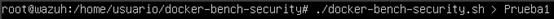
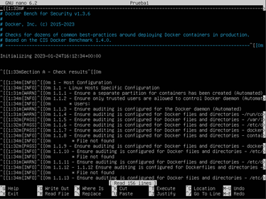
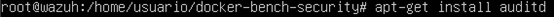
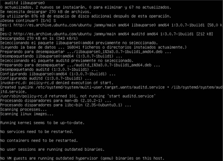
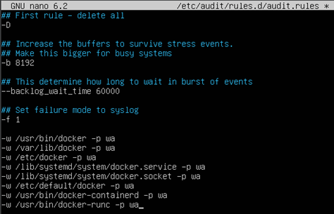
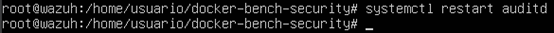
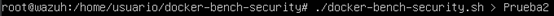
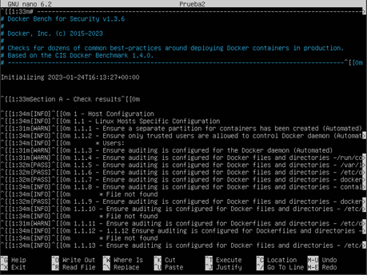
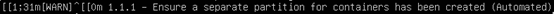
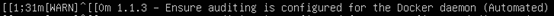

# Seguridad y desplegado de aplicaciones con Docker

# Docker-Bench

1. **Utiliza Docker-Bench y realiza un análisis previo de tu Docker.**

Instalamos “Docker-Bench”, accedemos al fichero “docker-bench-security” y ejecutamos el siguiente script:

1. **Utiliza AuditD para que analice todas las pruebas de la “Sección A”, referente al host “Configuration”.**

Instalamos “auditd” y modificamos el fichero “/etc/audit/rules.d/audit.rules” para añadir nuevas reglas.

Reiniciamos “auditd” para aplicar los cambios que hemos realizado anteriormente.

Volvemos a lanzar el escaneo pero ahora con las nuevas reglas que hemos escrito.

1. **Comenta 2 warnings que creas convenientes, y explica qué posible solución tendría.**
Warning 1:

Este error sucede porque Docker almacena toda su información, incluidas las imágenes de los sistemas que despliega, en un mismo directorio de manera predeterminada. Entonces, el peligro que existe, es que dicho directorio se puede colapsar y dejar a las máquinas fuera de servicio.
Una posible solución sería crear un volumen lógico que utilice como punto de montaje el directorio sobre el que reside Docker.

Warning 2:

El demonio de Docker, se ejecuta como administrador, entonces es conveniente auditar su actividad y uso. El error sucede a causa de dichas auditorías, ya que estas podrían generar archivos de registro de gran tamaño.
Una posible solución, aunque no estoy muy seguro de si esta sería una buena práctica, sería la de modificar el fichero “/etc/audit/audit.rules” y añadir la siguiente línea:
-w /usr/bin/dockerd –k docker
Esto lo que haría, sería no permitir que el demonio de Docker fuese auditado.

# Análisis de archivos dockerfile

Instalamos Trivy:

Montamos la imagen para poder analizarla con Trivy:

Analizamos la imagen montada con Trivy:

# Análisis de imágenes

Montamos el Docker Compose que contiene el WordPress (Latest):

docker-compose up

Mientras que se ejecuta la imagen, nos vamos a otra terminal y analizamos la imagen montada con Trivy:

Nota: Se me ha olvidado añadirle a la captura anterior la redirección del análisis a un nuevo archivo, pero aun así, lo he indicado abajo.

Como se observa en la imagen anterior, hemos volcado el resultado del análisis en un fichero de texto para que luego nos sea más fácil hacer la comparativa con el que sacaremos del WP V4.6.
A continuación, vamos a escribir el mismo comando, pero ahora lo haremos con la versión de WordPress 4.6. Esta vez, la información la sacará Trivy de unos repositorios online que tiene.

# Comparativa

WP Latest:

WP 4.6:

Como se observa en las anteriores imágenes, la versión 4.6 de WordPress, le saca más de 1000 vulnerabilidades a la última versión del mismo programa. Pero si nos enfocamos en una vulnerabilidad en concreto, como puede ser la que hemos encontrado del “Login”, podemos observar que en la versión 4.6 hay bastante más que en la última versión, quedando más que claro que es muchísimo más vulnerable que la actual.
